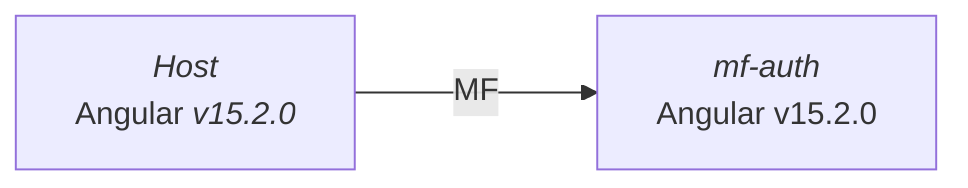

# Microfrontends mono-version con Module Federation

⚠️ Para una mejor experiencia de lectura recomiendo el uso de las siguientes extensiones de VsCode:

- [Markdown Preview Mermaid Support](https://marketplace.visualstudio.com/items?itemName=bierner.markdown-mermaid).
- [Markdown Preview Github Styling](https://marketplace.visualstudio.com/items?itemName=bierner.markdown-preview-github-styles)

Este enfoque no presenta ningún problema de enrutamiento ya que al tener un solo package.json, se comparte el mismo sistema
de enrutamiento `@angular/router` entre los microfrontends.

## Arquitectura

Para este ejemplo se ha decidido utilizar una arquitectura de microfrontends mono-version, es decir, todos los microfrontends comparten la misma versión de Angular.



> 💡 También es posible usar **module-fedaration** con Nx, más información en: [Nx Module Federation](https://nx.dev/recipes/module-federation/create-a-host).

## Schematics

Para agregar el paquete de [@angular-architects/module-federation](https://www.npmjs.com/package/@angular-architects/module-federation?activeTab=readme) podemos hacer uso del siguiente schematic en cada
una de las aplicaciones:

```bash
ng add @angular-architects/module-federation
```

Podemos hacer uso de multiples **banderas** para configurar el proyecto:

```bash
ng add @angular-architects/module-federation --project shell --port 4200 --type host
ng add @angular-architects/module-federation --project mfe1 --port 4201 --type remote
ng add @angular-architects/module-federation --type=dynamic-host
```

## Configuración

La configuración inicial es sencilla, basta con revisar el archivo `webpack.config.js` que se ha generado en la raíz del proyecto.

```typescript
const { shareAll, withModuleFederationPlugin } = require("@angular-architects/module-federation/webpack");

module.exports = withModuleFederationPlugin({
  name: "host",
});
```

En el caso del microfrontend debemos exponer el modulo principal de la aplicación:

```typescript
const { withModuleFederationPlugin } = require("@angular-architects/module-federation/webpack");

module.exports = withModuleFederationPlugin({
  name: "mf-authentication",

  exposes: {
    "./Module": "./projects/mf-authentication/src/app/authentication/authentication.module.ts",
  },
});
```

> 🚀 Para obtener más información sobre las diferentes configuraciones de webpack que nos permite compartir
> librerías o paquetes, consulta la [documentación](https://www.angulararchitects.io/blog/the-microfrontend-revolution-part-2-module-federation-with-angular/).

## Puntos relevantes

El host debe ser el encargado de cargar el archivo `mf.manifest.json` con las rutas de los microfrontends, al final cada ruta
no es más que un `remoteEntry.js` que se carga dinámicamente.

```typescript
// main.ts
initFederation("/assets/mf.manifest.json")
  .catch((err) => console.error(err))
  .then((_) => import("./bootstrap"))
  .catch((err) => console.error(err));
```

Finalmente en las rutas del host:

```typescript
const routes: Routes = [
  {
    path: "",
    pathMatch: "full",
    redirectTo: "page-a",
  },
  {
    path: "",
    loadChildren: () => import("./host/host.module").then((m) => m.HostModule),
  },
  {
    path: "authentication",
    loadChildren: () =>
      loadRemoteModule({
        type: "manifest",
        remoteName: "mf-authentication",
        exposedModule: "./Module",
      }).then((m) => m.AuthenticationModule),
  },
];
```
