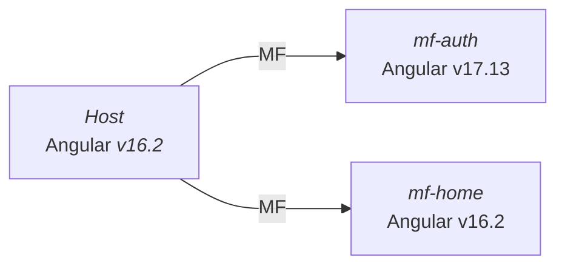

# Microfrontends multi-version con Module Federation

⚠️ Para una mejor experiencia de lectura recomiendo el uso de las siguientes extensiones de VsCode:

- [Markdown Preview Mermaid Support](https://marketplace.visualstudio.com/items?itemName=bierner.markdown-mermaid).
- [Markdown Preview Github Styling](https://marketplace.visualstudio.com/items?itemName=bierner.markdown-preview-github-styles)

Esta carpeta contiene cuatro aplicaciones como prototipos base usando una arquitectura de microfrontends con **múltiples
versiones** de Angular e incluso usando diferentes **Bibliotecas de Componentes**.

## Arquitectura



## Bien, pero ¿cómo se logra esto?

Bueno, para ello se recomienda el uso de **Module Federation** y **angular-elements** para convertir un componente Angular en un **web-component**.
Si vemos lo archivos **bootstrap** de cada microfrontend encontraremos algo como lo siguiente:

```typescript
(async () => {
  const gThis = globalThis as any;
  const app = await createApplication({
    providers: [...],
  });

  const mfAuthenticationRoot = createCustomElement(AppComponent, {
    injector: app.injector,
  });

  customElements.define('mf-authentication-root', mfAuthenticationRoot);
})();
```

Para versiones de **Angular <= 15**, realizamos la creación del **web-component** desde el AppModule, de la siguiente manera:

```typescript
@NgModule({
  declarations: [AppComponent],
  imports: [BrowserModule],
})
export class AppModule implements DoBootstrap {
  constructor(private injector: Injector) {}

  ngDoBootstrap() {
    const customElement = createCustomElement(AppComponent, {
      injector: this.injector,
    });

    customElements.define('mf-home-root', customElement);
  }
}
```

De esa manera creamos el **web-component**, lo registramos en el **DOM** y lo exponemos en el archivo **webpack.config.js**

```typescript
module.exports = withModuleFederationPlugin({
  name: "mf-authentication",

  exposes: {
    "./web-components": "./src/bootstrap.ts",
  },

  shared: { ... },
});
```

Finalmente el host define sus rutas donde hacemos uso de las utilidades **startsWith**, **WebComponentWrapper** y **WebComponentWrapperOptions**
para la carga de los **web-components**.

```typescript
{
    matcher: startsWith('authentication'),
    pathMatch: 'prefix',
    component: WebComponentWrapper,
    data: {
      type: 'module',
      remoteEntry: 'http://localhost:4201/remoteEntry.js',
      remoteName: 'mf-authentication',
      exposedModule: './web-components',
      elementName: 'mf-authentication-root',
    } as WebComponentWrapperOptions,
}
```

Para encontrar más detalle sobre esta implementación e incluso sobre la posibilidad de crear microfrontends
**multi-version** y **multi-framework** recomiendo leer este articulo de _Angular Architects_: [Multi-Framework and -Version Micro Frontends with Module Federation: Your 4 Steps Guide](https://www.angulararchitects.io/en/blog/multi-framework-and-version-micro-frontends-with-module-federation-your-4-steps-guide/)

## Problemas de enrutamiento entre microfrontends y solución

Esta solución pinta bien, pero trae consigo un problema de enrutamiento entre microfrontends. Debido a que cada microfront es representado
por un **web-component** y cuenta con sus propios **paquetes**, _genera su propia instancia de enrutamiento local_, es decir, solo conoce sus rutas y no
las externas (del host o de otros microfrontends).

> 💡 Cada microfront contiene su documentación sobre la solución de enrutamiento.

## Ejecución

Para correr cel proyecto seguimos los siguientes pasos:

1. Instalar dependencias del host y microfrontends.
2. Ejecutar el comando `npm start` en cada microfrontend.
