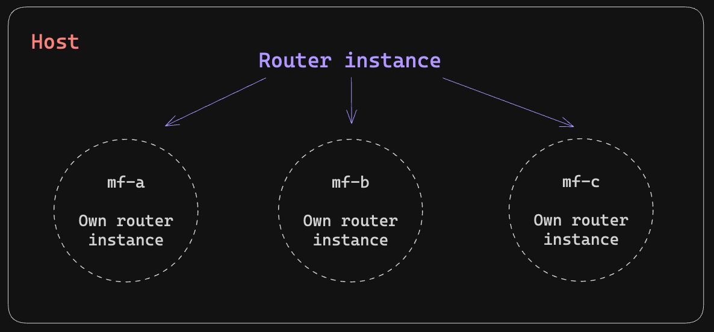

# Problemas de enrutamiento entre microfrontends y solución



Analizando la problemática se propone compartir el router del host (**quien si conoce las rutas y subrutas de los otros mf**) a los microfrontends por medio del objeto _**globalThis**_.

```typescript
// Host -> app.component.ts
constructor() {
  (globalThis as any).router = inject(Router);
}
```

> 💡 Al final esto se traduce en un problema de comunicación.

Cada microfront provee un servicio que usa como valor el router del host:

```typescript
//  bootstrap.ts
const app = await createApplication({
  providers: [
    gThis.router ? { provide: RouterGlobalUtil, useValue: gThis.router } : [],
  ],
});

// router-global-util.ts
@Injectable()
export class RouterGlobalUtil extends Router {}
```

Considerando una mejor experiencia de desarrollo, el RouterGlobal le da manejo a las rutas externas si estas no existen en el microfrontend.

```typescript
// mf-auth -> app.routes.ts
{
  path: '**',
  component: NotFoundComponent,
}

// NotFoundComponent
export class NotFoundComponent {
  private readonly globalRouter = inject(RouterGlobalUtil);
  private readonly location = inject(Location);

  constructor() {
    this.globalRouter.navigate(
      [`${location.pathname.substring(1)}${location.search}`],
      { state: this.location.getState() as RouterState }
    );
  }
}
```

Con esto también le damos soporte al estado del Router, podemos concluir que el uso de este servicio es transparente para el desarrollador.

**Implicaciones de este enfoque:**

- _Aunque este enfoque es funcional y fácil de implementar, hay que pensar y cuestionar su uso a futuro, si en algún momento Angular
  lanza una actualización donde la interfaz del Router cambie, quizá podría generar problemas en el enrutamiento_.
- _Considerar que la solución implica compartir por medio del DOM el router, en caso de usar SSR revisar si esto es posible._
- _Si un microfrontend x ya está montado (es visible), al intentar navegar a una subruta de este desde el host, no funciona._
