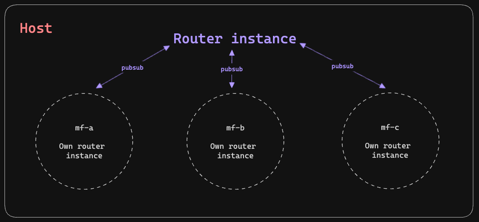

# Problemas de enrutamiento entre microfrontends y solución



Analizando la problemática se propone usar la librería **pubsub-js** para comunicar el enrutamiento del host hacia los microfrontends y viceversa:

```typescript
import PubSub from "pubsub-js";

const EVENT_NAME = "FOO";

const mySubscriber = (msg, data) => console.log(msg, data);
const token = PubSub.subscribe(EVENT_NAME, mySubscriber);

PubSub.publish(EVENT_NAME, "hello world!");
```

Más información en [PubSubJS - npm](https://www.npmjs.com/package/pubsub-js).

## Comunicación host hacia microfrontends

En el host comenzamos definiendo una suscripción a los eventos del router para comunicarlos hacia los microfrontends, para ello
haremos uso del método **publish** de **PubSub**, es importante incluir el **estado del router** y la **url actual** (la usaremos más adelante).

> 💡 Como recomendación creamos un archivo **routing-constants.ts** para definir los eventos.

```typescript
ngOnInit() {
  this.subscribeToHostRoutingChanges();
}

private subscribeToHostRoutingChanges() {
  this.subcription = this.router.events.subscribe((event) => {
    if (event instanceof NavigationEnd) {
      PubSub.publish(ROUTING_CONSTANTS.NOTIFYMF, {
        url: event.urlAfterRedirects,
        state: this.location.getState() as RouterState,
      });
    }
  });
}
```

Además de ello en el app.component de cada mf nos suscribimos a la constante publicada previamente y así recibir
los eventos (url y state) emitidos por el host.

```typescript
ngOnInit(): void {
  this.subscribeToPubSubRoutingEvents();
}

private subscribeToPubSubRoutingEvents() {
  PubSub.subscribe(
    ROUTING_CONSTANTS.NOTIFYMF,
    (__, { url, state }: MfNotification) => {
      if (url.includes('authentication')) {
        this.router.navigate([url], { state: state });
      }
    }
  );
}
```

> Algo muy importante que la URL contenga el nombre del micro para que solo realice la navegación en ese caso.

De esta manera podemos navegar desde el host hacia una ruta o subruta de un microfrontend.

## Comunicación microfrontends hacia host

Para este tipo hacemos usos del componente **NotFoundComponent** que se encarga de publicar un evento hacia el host cuando no encuentra una ruta.

```typescript
// mf-authentication  -> app.routes.ts
{
  path: '**',
  component: NotFoundComponent,
}

// mf-authentication -> not-found.component.ts
@Component({
  selector: 'app-not-found',
  template: '',
  standalone: true,
})
export class NotFoundComponent {
  private readonly location = inject(Location);

  constructor() {
    const mfNotification: MfNotification = {
      url: `${location.pathname.substring(1)}${location.search}`,
      state: this.location.getState() as RouterState,
    };

    PubSub.publish(ROUTING_CONSTANTS.NOTIFYHOST, mfNotification);
  }
}

```

> Hacemos uso del método **publish** para emitir un evento hacia el host con la URL y el estado del router.

Finalmente en el host agregamos un listener para recibir los eventos emitidos por los microfrontends. Es muy importante definir
la misma constante **ROUTING_CONSTANTS.NOTIFYHOST** usada en el microfrontend.

```typescript
ngOnInit() {
  this.subscribeToPubSubRoutingEvents();
}

private subscribeToPubSubRoutingEvents() {
  PubSub.subscribe(
    ROUTING_CONSTANTS.NOTIFYHOST,
    (__, data: HostNotification) => {
      this.router.navigate([data.url], { state: data.state });
    }
  );
}
```

Con estas configuraciones conseguimos una navegación **bidireccional** solucionando el problema de enrutamiento entre microfrontends.
